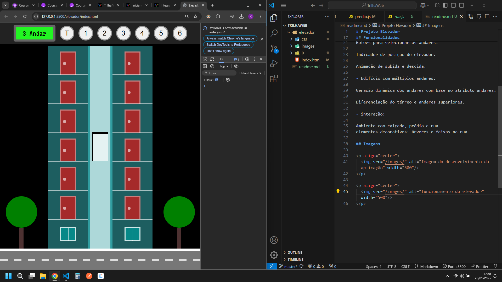
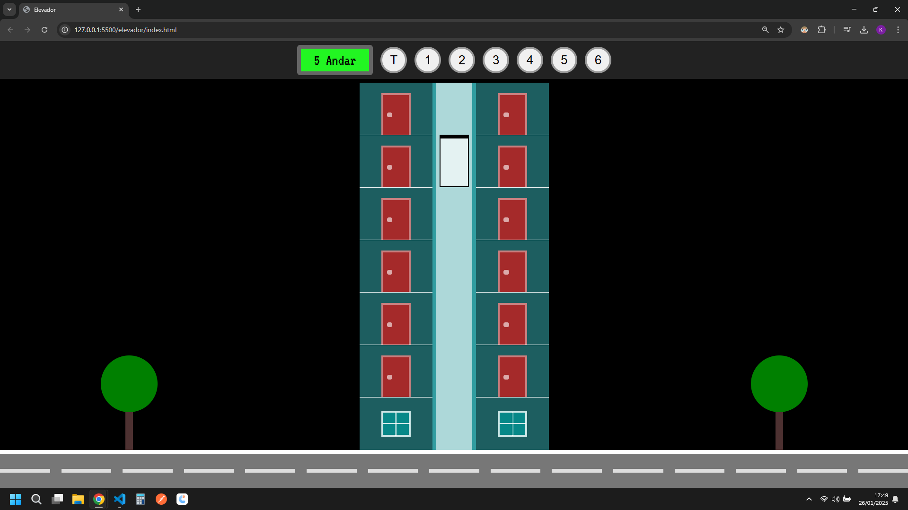

# Projeto Elevador

Este projeto simula um elevador funcional em um prédio, o foco é a integração do HTML, CSS e JavaScript, com lógica que permite o usuário o controle e a movimentação do elevador entre diferentes andares de forma interativa.

## Estrutura do Projeto

O projeto é composto pelos seguintes arquivos principais:

index.html: Estrutura da interface do usuário.

css/style.css: Toda estilização e responsividade.

js/rua.js: Manipulação do dom para a criação das faixas da rua.

js/predio.js: Manipulação dos andares, movimentação do elevador e dos controles.

## Funcionalidades

- controle do elevador:

Botões para selecionar os andares.

Indicador de posição do elevador.

Animação de subida e descida.

- Edifício com múltiplos andares:

Geração dinâmica dos andares com base no atributo andares.

Diferenciação do térreo e andares superiores.

- interação:

ambiente com calçada, prédio e rua.
elementos decorativos: árvores e faixas na rua.

## Imagens

  

  

